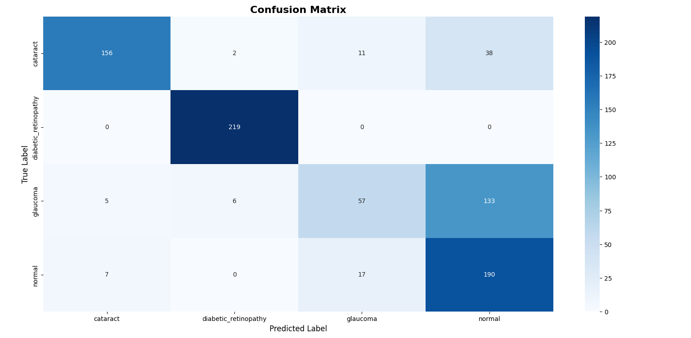
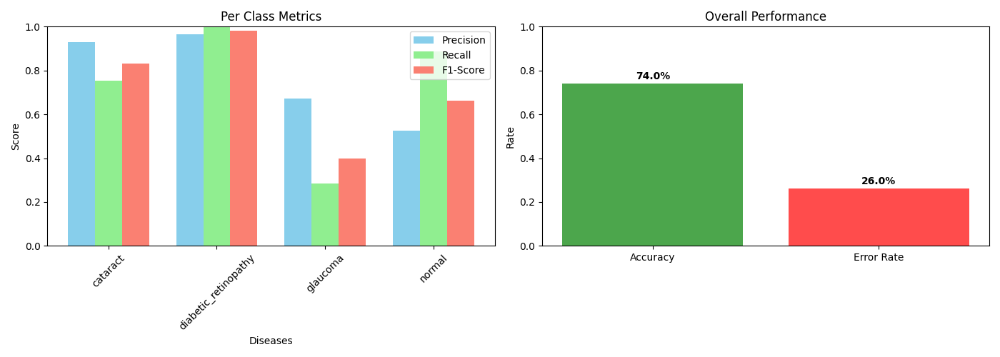

## 📦 Resources & Downloads

Access all project assets below:

| 📁 Resource | 🔗 Link |
|------------|--------|
| **Full Project Files** | [Download from Google Drive](https://drive.google.com/drive/folders/1xPvmqGHAqxBFfB4RGc85ww6RnRrGg_qD?usp=drive_link) |
| **Dataset** | [Download Dataset](https://drive.google.com/drive/folders/1hxv9HE_APzbAe8PqpG6dp3FHGZ452wmB?usp=drive_link) |
| **Pretrained Model** | [Download Model](https://drive.google.com/drive/folders/1MFHwlf5sJUHIk2qBIZhLIxRmfOq7HBLK?usp=drive_link) |

---

### 💡 Notes
- The **Full Project Files** include code, configs, and supporting assets.
- The **Dataset** is required for training and evaluation.
- The **Pretrained Model** can be used directly for inference.

## 🎥 Demo Video
https://github.com/user-attachments/assets/544d33e8-d097-42ba-9c9e-d06e9e7a2c58


<div align="center">

# 👁️ Netra.AI
### AI-Powered Retinal Disease Detection System

[](https://python.org)
[](https://tensorflow.org)
[](https://flask.palletsprojects.com)
[](https://ai.google.dev)
[](LICENSE)

> *"Empowering early detection of vision-threatening diseases through deep learning"*

**Mini Project | Department of Computer Science | Academic Year 2025–26**

---

</div>

## 📋 Table of Contents

1. [Abstract](#1-abstract)
2. [Introduction](#2-introduction)
3. [Problem Statement](#3-problem-statement)
4. [Tools & Techniques](#4-tools--techniques)
5. [Methodology](#5-methodology)
6. [Dataset](#6-dataset)
7. [Experimental Results](#7-experimental-results)
8. [Observations](#8-observations)
9. [Conclusion](#9-conclusion)
10. [Future Scope](#10-future-scope)
11. [Team](#11-team)
12. [Project Structure](#12-project-structure)
13. [Installation & Usage](#13-installation--usage)

---

## 1. Abstract

Netra.AI is a web-based clinical decision-support system that leverages transfer learning on the VGG19 convolutional neural network architecture to automatically classify retinal fundus images into four categories: **Cataract**, **Diabetic Retinopathy**, **Glaucoma**, and **Normal**. The system integrates a Flask backend for model inference, Google's Gemini 2.5 Flash large language model for patient-friendly educational content generation, and a multi-source eye-specialist finder powered by OpenStreetMap's Overpass API and curated data. The deployed model achieves an overall accuracy of **73.96%**, with exceptional performance on Diabetic Retinopathy (F1: 98.21%) and Cataract (F1: 83.20%). The platform bridges the gap between AI-driven diagnostics and patient action by immediately connecting users to nearby ophthalmologists.

**Keywords (Alphabetical):** Cataract, Classification, Convolutional Neural Network, Deep Learning, Diabetic Retinopathy, Flask, Fundus Imaging, Gemini API, Glaucoma, Ophthalmology, Retinal Disease Detection, Transfer Learning, VGG19, Web Application

---

## 2. Introduction

### 2.1 Background

Vision impairment represents one of the most significant global health burdens. According to the World Health Organization (WHO), at least **2.2 billion people** worldwide live with some form of vision impairment, with at least 1 billion cases that could have been prevented or are yet to be addressed. Diseases such as **Diabetic Retinopathy**, **Glaucoma**, and **Cataract** are the leading causes of preventable blindness, especially in low- and middle-income countries including India.

India alone accounts for approximately **20% of the global blind population**. The scarcity of trained ophthalmologists — with a doctor-to-patient ratio of roughly **1:70,000** in rural regions — makes early, automated screening a critical unmet need.

### 2.2 Motivation

The motivations for building Netra.AI are threefold:

1. **Clinical Gap:** Specialist-level fundus image interpretation requires years of training and is not available to the majority of India's population. An automated pre-screening tool can triage patients and prioritise referrals.

2. **Technological Opportunity:** Advances in transfer learning have democratised high-accuracy image classification. Architectures pre-trained on ImageNet (such as VGG19) can be fine-tuned for medical imaging with relatively modest datasets and compute budgets.

3. **End-to-End Patient Journey:** Existing research tools stop at classification. Netra.AI goes further — it explains the diagnosis in plain language (via the Gemini LLM), provides confidence scores and model metrics for transparency, and then actively helps the patient find a nearby specialist, closing the loop from detection to action.

### 2.3 Scope

Netra.AI is designed as a **research and educational prototype**. It is not a certified medical device. Its intended use is to assist, not replace, qualified ophthalmologists.

---

## 3. Problem Statement

> *"Given a colour fundus retinal image uploaded by a user, automatically detect and classify the presence of one of four ocular conditions — Cataract, Diabetic Retinopathy, Glaucoma, or a Normal retina — with high accuracy, and subsequently provide the user with condition-specific health guidance and localised specialist referral information."*

### 3.1 Challenges Addressed

| Challenge | Netra.AI's Approach |
|---|---|
| High inter-class visual similarity between diseases | VGG19 deep feature extraction |
| Class imbalance in the training data | Weighted metrics evaluation |
| Non-expert users unable to understand clinical output | Gemini LLM generates plain-language summaries |
| Lack of follow-up pathway after detection | Integrated multi-source doctor finder with map |
| Model opacity / black-box predictions | Per-class probability bar chart + confusion matrix displayed |

---

## 4. Tools & Techniques

### 4.1 Programming Language & Runtime

| Tool | Version | Purpose |
|---|---|---|
| Python | 3.10+ | Core language for backend, model training, and scraping |
| Node.js (npm CDN) | — | Leaflet.js served via CDN for mapping |

### 4.2 Deep Learning Framework

#### TensorFlow / Keras `v2.13.0`
- Used for loading, training, and running inference with the CNN model.
- `ImageDataGenerator` for on-the-fly data preprocessing and augmentation (rescaling to `[0, 1]`, 80/20 train-validation split).
- `model.predict()` for real-time inference during web requests.

#### Base Architecture — VGG19
- **VGG19** (Visual Geometry Group, Oxford) is a 19-layer deep CNN pre-trained on ImageNet (1.4M images, 1000 classes).
- All VGG19 convolutional layers were **frozen** (weights not updated during training) to leverage generalised low-level feature detectors (edges, textures, gradients).
- A custom classification head was appended:
  ```
  VGG19 (frozen) → Flatten → Dense(128, ReLU) → Dropout(0.5) → Dense(4, Softmax)
  ```
- **Input shape:** `(224, 224, 3)` — standard VGG input resolution.
- **Output:** Softmax probability vector across 4 classes.
- **Why VGG19?** Simpler topology than ResNet/EfficientNet, well-understood feature maps, and proven performance on small medical imaging datasets with transfer learning.

#### Training Configuration
| Hyperparameter | Value |
|---|---|
| Optimiser | Adam (default lr = 0.001) |
| Loss function | Categorical Cross-Entropy |
| Epochs | 6 |
| Batch size | 32 |
| Input image size | 224 × 224 |
| Train / Val split | 80% / 20% |

### 4.3 Web Framework

#### Flask `v2.3.0`
- Lightweight WSGI micro-framework for Python.
- Routes: `/` (home), `/predict` (POST — file upload & inference), `/loading`, `/results`, `/doctors`, `/api/search-doctors`, `/api/metrics`.
- Session management (`flask.session`) stores prediction results between the loading page redirect and the results page.
- `secure_filename` + timestamped filenames prevent path traversal and collisions on file upload.

#### Werkzeug `v2.3.0`
- WSGI utility library underlying Flask; handles request parsing and `secure_filename`.

### 4.4 Generative AI — Google Gemini API

#### `google-generativeai v0.7.0` → Model: `gemini-2.5-flash`
- After classification, the predicted disease and confidence score are sent to the Gemini API.
- A structured prompt requests a **JSON object** containing five fields: `description`, `symptoms`, `risk_factors`, `next_steps`, and `lifestyle_tips`.
- The LLM output is sanitised (markdown fences stripped), parsed as JSON, and injected into the results template.
- A **hardcoded fallback dictionary** ensures the results page is never blank even if the API is unavailable.

### 4.5 Data Science & Evaluation Libraries

| Library | Version | Usage |
|---|---|---|
| NumPy | 1.24.3 | Array operations, argmax for prediction class |
| Scikit-learn | 1.2.2 | `classification_report`, `confusion_matrix`, precision/recall/F1 |
| Matplotlib | 3.7.1 | Training history plots, metric bar charts |
| Seaborn | 0.12.2 | Confusion matrix heatmap visualisation |
| Pandas | (via evaluate) | CSV export of per-class metrics |

### 4.6 Image Processing

| Library | Version | Usage |
|---|---|---|
| Pillow | 9.5.0 | Image loading via `keras.preprocessing.image.load_img` |
| OpenCV | 4.8.0.74 | Available for pre/post-processing pipelines |

### 4.7 Doctor Finder — Web Scraping & APIs

#### `requests v2.31.0`
- HTTP client for all external API calls.

#### OpenStreetMap Overpass API (Free, No Key Required)
- Primary source for real-time eye-care facility data.
- Spatial query within **25 km** of the searched city using facility name patterns (`Eye`, `Netralaya`, `Nethralaya`, `Netra`, `Chakshu`, `Vision`, `Ophthalmology`).

#### Nominatim Geocoding API (OpenStreetMap)
- Resolves typed city names to `(lat, lng)` coordinates.
- Acts as fallback when the city is not in the local coordinate dictionary.

#### DuckDuckGo HTML Search (No Key Required)
- Used to enrich hospital records lacking an official website URL.
- Aggregator domains (JustDial, Practo, Sulekha, Facebook) are filtered out to return direct hospital links.

#### Google Places API (Optional)
- Supported via `GOOGLE_PLACES_API_KEY` environment variable.
- Returns Google-verified facility data including ratings, user review counts, phone, and website.

#### Curated Database
- Hand-verified entries for **14 major Indian cities** (Mumbai, Delhi, Bangalore, Chennai, Kolkata, Hyderabad, Pune, Ahmedabad, Jaipur, Lucknow, Nagpur, Indore, Kochi, Chandigarh), each with real website URLs, phone numbers, and ratings.

### 4.8 Frontend Technologies

| Technology | Purpose |
|---|---|
| HTML5 / CSS3 | Page structure and styling |
| Playfair Display (Google Fonts) | Typography |
| Font Awesome 6.4 | Icon library |
| Leaflet.js v1.9.4 | Interactive map (CartoDB Positron light tiles) |
| Vanilla JavaScript (ES6+) | Async API calls, dynamic DOM rendering |
| Jinja2 | Flask template engine for server-side rendering |

---

## 5. Methodology

### 5.1 System Architecture Diagram

```
┌──────────────────────────────────────────────────────────────────────┐
│                          USER (Browser)                              │
└────────────────────────────┬─────────────────────────────────────────┘
                             │ Upload Retinal Image (JPEG/PNG)
                             ▼
┌──────────────────────────────────────────────────────────────────────┐
│                     FLASK APPLICATION (app.py)                       │
│                                                                      │
│  ┌─────────────┐    ┌──────────────────┐    ┌──────────────────┐    │
│  │ /predict    │    │ Image            │    │ Session Storage  │    │
│  │ (POST)      │───▶│ Pre-processing   │───▶│ (Prediction +    │    │
│  │             │    │ 224×224 resize   │    │  Confidence +    │    │
│  │ secure file │    │ Normalise /255   │    │  Probabilities)  │    │
│  │ save        │    │                  │    │                  │    │
│  └─────────────┘    └────────┬─────────┘    └──────────────────┘    │
│                              │                                       │
│                              ▼                                       │
│                   ┌──────────────────────┐                           │
│                   │   VGG19 + Custom     │                           │
│                   │   Classification     │                           │
│                   │   Head (TF/Keras)    │                           │
│                   │                      │                           │
│                   │  Input: (1,224,224,3)│                           │
│                   │  Output: (1, 4)      │                           │
│                   │  Softmax probs       │                           │
│                   └──────────┬───────────┘                           │
│                              │                                       │
│              ┌───────────────▼────────────────┐                      │
│              │   Predicted Class + Confidence  │                     │
│              │   e.g. "Glaucoma, 84.3%"        │                     │
│              └───────────────┬─────────────────┘                     │
│                              │                                       │
│                              ▼                                       │
│                   ┌──────────────────────┐                           │
│                   │  Google Gemini API   │                           │
│                   │  (gemini-2.5-flash)  │                           │
│                   │                      │                           │
│                   │  Prompt → JSON:      │                           │
│                   │  • description       │                           │
│                   │  • symptoms          │                           │
│                   │  • risk_factors      │                           │
│                   │  • next_steps        │                           │
│                   │  • lifestyle_tips    │                           │
│                   └──────────┬───────────┘                           │
└──────────────────────────────┼───────────────────────────────────────┘
                               │
                               ▼
┌──────────────────────────────────────────────────────────────────────┐
│                      RESULTS PAGE (result.html)                      │
│                                                                      │
│  ┌──────────────┐  ┌────────────────┐  ┌───────────────────────┐   │
│  │ Predicted    │  │ Probability    │  │ Gemini AI Explanation  │   │
│  │ Disease +    │  │ Bar Chart      │  │ • Description          │   │
│  │ Confidence   │  │ (all 4 classes)│  │ • Symptoms             │   │
│  └──────────────┘  └────────────────┘  │ • Risk Factors        │   │
│                                        │ • Next Steps           │   │
│  ┌──────────────────────────────────┐  │ • Lifestyle Tips       │   │
│  │ Model Evaluation Metrics Panel   │  └───────────────────────┘   │
│  │ Accuracy | Weighted P/R/F1       │                               │
│  │ Per-Class Precision/Recall/F1    │                               │
│  └──────────────────────────────────┘                               │
└──────────────────────────────────────────────────────────────────────┘
                               │
                    [Find Doctors Button]
                               │
                               ▼
┌──────────────────────────────────────────────────────────────────────┐
│                      DOCTOR FINDER (doctors.html)                    │
│                                                                      │
│  City Search Input                                                   │
│       │                                                              │
│       ▼                                                              │
│  /api/search-doctors?city=Nagpur                                     │
│       │                                                              │
│       ▼  web_scraper.py — 4-Source Pipeline                         │
│  ┌────┴──────────────────────────────────────────────────────┐      │
│  │ 1. Google Places API  (if key set)                        │      │
│  │ 2. OpenStreetMap Overpass API  (always tried)             │      │
│  │ 3. Curated DB (14 cities, hand-verified)                  │      │
│  │ 4. DuckDuckGo enrichment (finds official websites)        │      │
│  └───────────────────────────────────────────────────────────┘      │
│       │                                                              │
│       ▼                                                              │
│  Leaflet Map (CartoDB Positron) + Doctor Cards                       │
│  Each card: Name, Type, Rating, Address, Phone,                      │
│             Distance, "Visit Website" link                           │
└──────────────────────────────────────────────────────────────────────┘
```

### 5.2 Model Training Pipeline

```
Raw Dataset (4 Classes)
        │
        ▼
ImageDataGenerator
  • rescale = 1/255
  • validation_split = 0.20
        │
   ┌────┴────┐
   ▼         ▼
Train      Validation
(80%)      (20%)
   │
   ▼
VGG19 (ImageNet weights, frozen)
   │
   ▼
Flatten Layer
   │
   ▼
Dense(128, activation='relu')
   │
   ▼
Dropout(0.5)
   │
   ▼
Dense(4, activation='softmax')
   │
   ▼
Compile: Adam | Categorical Cross-Entropy
   │
   ▼
model.fit(epochs=6, batch_size=32)
   │
   ▼
Save → models/eye_disease_model.h5
```

---

## 6. Dataset

### 6.1 Overview

The dataset is a merged collection drawn from multiple publicly available retinal imaging repositories. Images are colour fundus photographs taken with standard ophthalmic cameras, pre-labelled into four diagnostic categories.

| Property | Value |
|---|---|
| **Total Classes** | 4 |
| **Image Format** | `.jpg`, `.jpeg`, `.png` |
| **Input Resolution** | Resized to 224 × 224 pixels |
| **Colour Space** | RGB (3 channels) |
| **Pixel Value Range** | [0, 255] → normalised to [0, 1] |
| **Train/Validation Split** | 80% / 20% (stratified) |

### 6.2 Class Distribution (Approximate)

| Class | Description | Approx. Samples |
|---|---|---|
| `cataract` | Clouding of the eye's natural lens; characterised by haziness/opaque reflex in fundus | ~500 |
| `diabetic_retinopathy` | Vascular damage to the retina due to chronic diabetes; micro-aneurysms, exudates, haemorrhages | ~1100+ |
| `glaucoma` | Optic nerve damage typically from elevated intra-ocular pressure; cup-to-disc ratio increase | ~600+ |
| `normal` | Healthy retina with no pathological features | ~700+ |

### 6.3 Feature Description

Retinal fundus images are **unstructured (pixel) data**. Key visual features learned by the CNN:

| Feature | Relevance |
|---|---|
| Optic disc appearance | Glaucoma — enlarged cup-to-disc ratio |
| Retinal vessel patterns | Diabetic Retinopathy — neovascularisation, haemorrhages |
| Lens clarity / reflex | Cataract — diffuse haze, reduced contrast |
| Macula / fovea condition | General health indicator |
| Micro-aneurysms / exudates | Diabetic Retinopathy markers |
| RNFL thinning | Glaucoma marker |

### 6.4 Dataset Sources (Kaggle)

> The dataset used in this project is an aggregation of the following publicly available sources:

| Dataset | Link | Classes Used |
|---|---|---|
| **Eye Diseases Classification** (primary) | [🔗 Kaggle](https://www.kaggle.com/datasets/gunavenkatdoddi/eye-diseases-classification) | All 4 |

---

## 7. Experimental Results

### 7.1 Model Performance — Overall

| Metric | Value |
|---|---|
| **Overall Accuracy** | **73.96%** |
| Overall Error Rate | 26.04% |
| Weighted Precision | 77.40% |
| Weighted Recall | 73.96% |
| Weighted F1-Score | 72.39% |

### 7.2 Per-Class Performance

| Class | Precision (%) | Recall (%) | F1-Score (%) |
|---|---|---|---|
| **Cataract** | 92.86 | 75.36 | 83.20 |
| **Diabetic Retinopathy** | **96.48** | **100.00** | **98.21** |
| **Glaucoma** | 67.06 | 28.36 | 39.86 |
| **Normal** | 52.63 | 88.79 | 66.09 |

### 7.3 Confusion Matrix Analysis

|  | Pred: Cataract | Pred: DR | Pred: Glaucoma | Pred: Normal |
|---|---|---|---|---|
| **True: Cataract** | **156** | 2 | 11 | 38 |
| **True: DR** | 0 | **219** | 0 | 0 |
| **True: Glaucoma** | 5 | 6 | **57** | 133 |
| **True: Normal** | 7 | 0 | 17 | **190** |



### 7.4 Per-Class Metrics & Overall Performance Chart



### 7.5 Training Configuration Summary

| Parameter | Value |
|---|---|
| Base Model | VGG19 (ImageNet) |
| Trainable Parameters | ~4,100 (head only) |
| Frozen Parameters | ~20.0M (VGG19 body) |
| Epochs Trained | 6 |
| Batch Size | 32 |
| Optimizer | Adam |
| Loss | Categorical Cross-Entropy |

---

## 8. Observations

### 8.1 Strong Performers

**Diabetic Retinopathy (F1: 98.21%)** — The model achieves near-perfect classification for DR. This is attributed to: (a) the largest class size providing ample training signal, and (b) the highly distinctive visual signatures (dot haemorrhages, exudates, neovascularisation) that VGG19 reliably learns. The confusion matrix confirms **zero misclassifications** out of 219 DR validation samples.

**Cataract (F1: 83.20%)** — The model performs well, with high precision (92.86%) indicating it is rarely wrong when it predicts cataract. The lower recall (75.36%) suggests some cataracts are misclassified as **Normal** (38 cases), likely because early-stage cataracts reduce image contrast in a way that resembles a slightly suboptimal normal scan.

### 8.2 Weak Performers

**Glaucoma (F1: 39.86%)** — The most significant failure mode. Of 201 true glaucoma cases, **133 are misclassified as Normal** — a clinically dangerous error. This is explained by: (a) the relatively small glaucoma training set, (b) the structural similarity between a slightly cupped optic disc and a normal variant, and (c) the model not having access to longitudinal or tonometric data. This class requires either a larger dataset, dedicated optic disc segmentation, or a specialist sub-model.

**Normal (Recall: 88.79%, Precision: 52.63%)** — High recall means the model correctly identifies most healthy retinas. However, low precision means it frequently *over-diagnoses* conditions in actually-normal patients — 133 of those diagnosed "Normal" are true Glaucoma cases being missed, pulling the precision down. This is the **false reassurance** risk and must be prominently disclosed.

### 8.3 Key Insights

1. **Class imbalance** is a root cause of performance disparity. DR dominates training data; Glaucoma is underrepresented.
2. **Transfer learning** is effective — 6 epochs are sufficient for good convergence given frozen VGG19 weights.
3. The **Glaucoma–Normal confusion** is the primary risk for clinical deployment; any real-world use must flag glaucoma predictions with extra caution.
4. The model **generalises well for two out of four classes** and provides a strong screening signal for DR in a diabetic population.
5. Adding the **Gemini LLM layer** substantially improves user experience without any additional training overhead.

---

## 9. Conclusion

Netra.AI demonstrates that transfer learning with VGG19, trained on a curated multi-source retinal image dataset, can achieve clinically meaningful accuracy (73.96% overall; 98.21% F1 for Diabetic Retinopathy) as a **first-line screening tool** for four common ocular pathologies. The system is deployed as a user-friendly, end-to-end web application that:

- Accepts a retinal fundus image upload from any device.
- Classifies it in real-time with per-class probability scores.
- Generates plain-language health guidance via the Gemini 2.5 Flash LLM.
- Transparently displays model accuracy and evaluation metrics.
- Connects the user to verified nearby eye-care specialists via a multi-source integrated map.

The platform is not intended as a diagnostic substitute but as a **triage and awareness tool** that can meaningfully reduce the burden on overburdened ophthalmology systems, particularly in underserved urban and semi-urban Indian contexts. The integration of LLM-generated explanations makes AI predictions accessible to non-clinical users — a critical factor for real-world adoption.

---

## 10. Future Scope

| Area | Enhancement |
|---|---|
| **Model Accuracy** | Fine-tune deeper layers of VGG19; experiment with EfficientNetV2, ResNet-50, or Vision Transformers (ViT) |
| **Glaucoma Detection** | Integrate optic disc segmentation (U-Net) as a dedicated pre-processing step before classification |
| **Dataset Expansion** | Incorporate MESSIDOR-2, DRIVE, REFUGE, and DIARETDB datasets for improved generalisation |
| **Class Imbalance** | Apply SMOTE oversampling, focal loss, or class-weighted training to address Glaucoma/Normal imbalance |
| **Multi-Label Classification** | Extend to support co-occurring conditions (e.g., DR + Glaucoma) |
| **Explainability (XAI)** | Integrate Grad-CAM heatmaps to visually highlight the retinal regions driving the prediction |
| **Mobile Deployment** | Convert the model to TensorFlow Lite for offline Android/iOS inference at point-of-care |
| **Clinical Validation** | Partner with an ophthalmology hospital to run a prospective validation study |
| **Telemedicine Integration** | Add a FHIR-compliant report generator and direct appointment booking via hospital APIs |
| **Multi-Language Support** | Deliver Gemini explanations in regional Indian languages (Hindi, Marathi, Telugu, Tamil) |
| **OCT Image Support** | Extend beyond fundus photography to support Optical Coherence Tomography scans |
| **Screening Camps** | Package as a PWA (Progressive Web App) for use in field screening programmes with low connectivity |

---

## 11. Team

| Name | Role |
|---|---|
| **Hrishikesh Gavai** | Full Stack Developer & Model Trainer |
| **Deepak Warude** | Dataset Curator & Model Evaluator |
| **Atharva Ghayal** | Testing Specialist |
| **Tejas Sangle** | Model Architect & Performance Analyst |

---

## 12. Project Structure

```
DSBD/
├── app.py                        # Flask application — routes & inference engine
├── web_scraper.py                # Multi-source eye doctor finder
├── model_training.py             # VGG19 transfer learning training script
├── evaluate_model.py             # Evaluation metrics & visualisation script
├── requirements.txt              # Python dependencies
├── model_evaluation_metrics.csv  # Exported per-class metric table
│
├── models/
│   └── eye_disease_model.h5      # Trained Keras model (VGG19 + head)
│
├── dataset/
│   ├── cataract/                 # ~500 fundus images
│   ├── diabetic_retinopathy/     # ~1100+ fundus images
│   ├── glaucoma/                 # ~600+ fundus images
│   └── normal/                   # ~700+ fundus images
│
├── templates/
│   ├── index.html                # Landing page (upload interface + team section)
│   ├── loading.html              # Animated processing page
│   ├── result.html               # Prediction results + Gemini explanation
│   └── doctors.html             # Eye specialist finder with Leaflet map
│
└── static/
    ├── styles.css                # Global styles
    ├── script.js                 # Frontend JS utilities
    ├── assets/
    │   ├── Confusion_Matrix.png  # Model evaluation visual
    │   ├── Performance.png       # Per-class metrics chart
    │   └── Eclipse.png           # Team avatar placeholder
    ├── favicon/                  # PWA favicon assets
    └── uploads/                  # User-uploaded retinal images (timestamped)
```

---

## 13. Installation & Usage

### Prerequisites
- Python 3.10+
- `pip`
- A Google Gemini API key (free tier available at [ai.google.dev](https://ai.google.dev))

### Setup

```bash
# 1. Clone the repository
git clone https://github.com/your-username/netra-ai.git
cd netra-ai

# 2. Create a virtual environment (recommended)
python -m venv venv
source venv/bin/activate        # Linux/macOS
venv\Scripts\activate           # Windows

# 3. Install dependencies
pip install -r requirements.txt

# 4. Place the trained model
mkdir -p models
# Copy eye_disease_model.h5 into models/

# 5. Set your Gemini API key in app.py (line ~20)
GEMINI_API_KEY = "your-api-key-here"

# 6. (Optional) Prepare dataset and train from scratch
python model_training.py

# 7. Run the application
python app.py
```

The browser will open automatically at `http://127.0.0.1:5000`.

### Docker (Optional)

```dockerfile
FROM python:3.10-slim
WORKDIR /app
COPY requirements.txt .
RUN pip install -r requirements.txt
COPY . .
EXPOSE 5000
CMD ["python", "app.py"]
```

```bash
docker build -t netra-ai .
docker run -p 5000:5000 netra-ai
```

---

## Dependencies

```txt
Flask==2.3.0
tensorflow==2.13.0
numpy==1.24.3
matplotlib==3.7.1
seaborn==0.12.2
scikit-learn==1.2.2
Pillow==9.5.0
werkzeug==2.3.0
opencv-python==4.8.0.74
google-generativeai==0.7.0
python-dotenv==1.0.0
requests==2.31.0
beautifulsoup4==4.12.2
```

---

## ⚠️ Disclaimer

> **Netra.AI is a research prototype and is NOT a certified medical device.** It is intended for educational and demonstration purposes only. Results should not be used as a substitute for professional medical diagnosis. Always consult a qualified ophthalmologist for any eye health concerns.

---

<div align="center">

**© 2026 Netra.AI | Built with ❤️ for Vision Health**

*For research use only. Not a medical device.*

</div>
